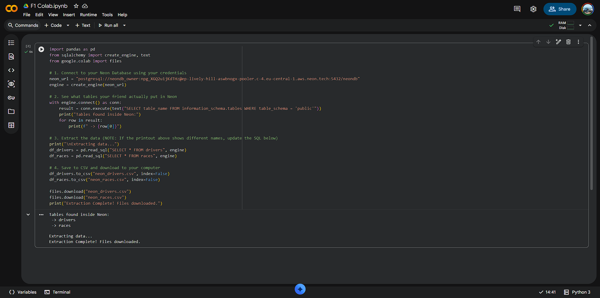
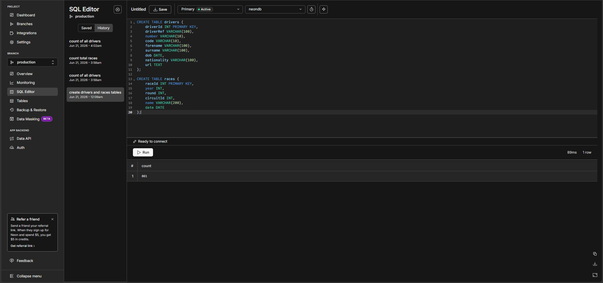
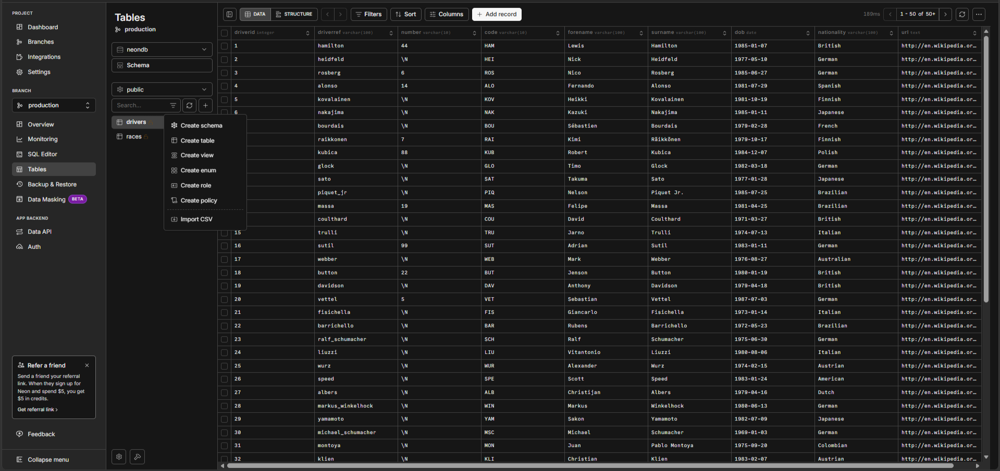
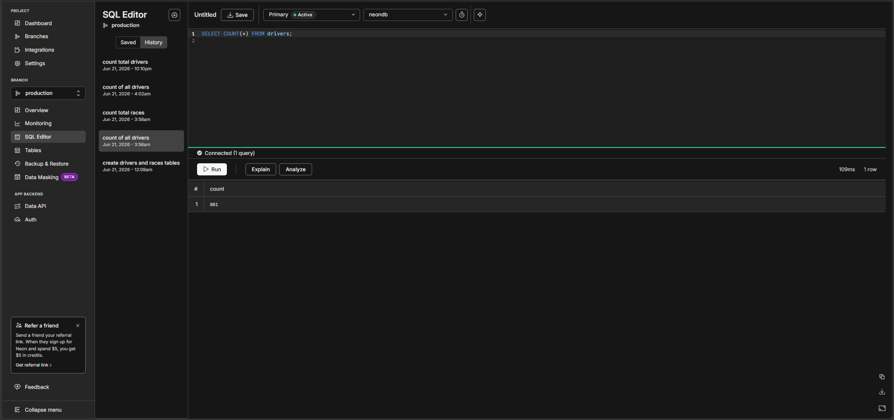

# Neon PostgreSQL Relational Database Setup

This section documents the creation and validation of the serverless PostgreSQL environment used as the relational source for the hybrid architecture.

### 1. Data Extraction Logic (Colab)
*Brief: Illustrates the Python-based extraction process used to pull raw data securely from the Neon environment.*

### 2. Database Schema Creation (DDL)
*Brief: Execution of the DDL statements in the Neon SQL Editor to construct the core relational tables (`drivers` and `races`).*

### 3. Relational Data Verification
*Brief: Validating the relational database environment by displaying the structured driver schema and verifying the successful load of 861 rows.*
  

