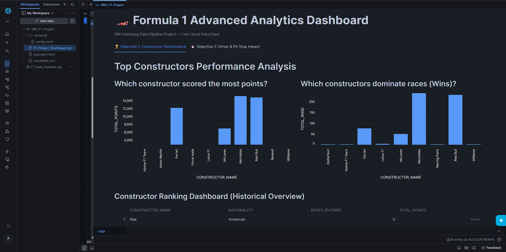
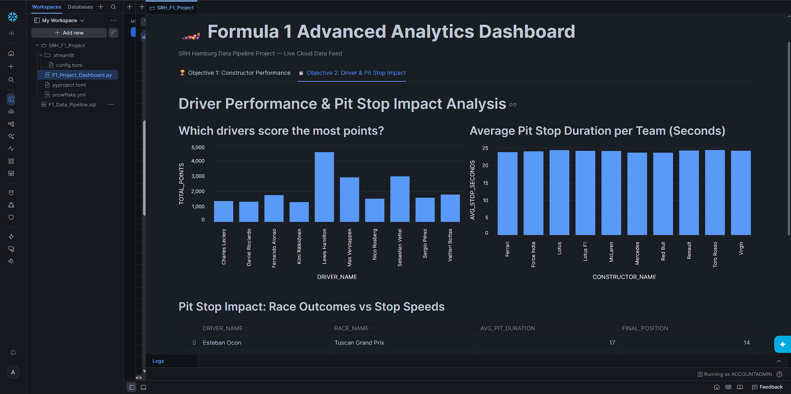

# Formula 1 Hybrid Cloud Data Ingestion & Analytics Pipeline

## Project Overview
This project fulfills the Data Engineering final project requirements. The goal was to build a dual-pipeline ingestion engine processing F1 data from an Object Store (AWS S3) and a Relational Database (Neon PostgreSQL) to fulfill two distinct business analytics objectives.

## Evidence & Documentation

### Pipeline 1: Snowflake & AWS Ingestion
This section documents the streaming data pipeline utilizing Snowpipe to automatically ingest F1 data stored in an S3 bucket into Snowflake tables.

**1. Analytics Dashboard (Constructor Performance)** *Brief: Visualizes aggregated F1 constructor data to identify points leaders and race dominance patterns.* 

**2. Analytics Dashboard (Pit Stop Impact)** *Brief: Analyzes the statistical correlation between driver performance and pit stop efficiency metrics.* 

**3. Snowflake Pipeline SQL Logic** *Brief: Demonstrates the CREATE TABLE and data ingestion logic executed in Snowflake to maintain the F1 dataset.* 

### Pipeline 2: Neon PostgreSQL Relational Database Setup
This section documents the creation and validation of the serverless PostgreSQL environment used as the relational source for the hybrid architecture.

**1. Data Extraction Logic (Colab)** *Brief: Illustrates the Python-based extraction process used to pull raw data securely from the Neon environment.* 

**2. Database Schema Creation (DDL)** *Brief: Execution of the DDL statements in the Neon SQL Editor to construct the core relational tables (`drivers` and `races`).* 

**3. Relational Data Verification** *Brief: Validating the relational database environment by displaying the structured driver schema and verifying the successful load of 861 rows.*   

## Complete Architecture Breakdown
* **Snowflake/AWS Pipeline:** Built a cloud data warehouse using Snowpipe for automated streaming file ingestion from S3, outputted via a native Streamlit Dashboard application.
* **Databricks Engine:** Engineered a Medallion architecture (Bronze -> Silver -> Gold layers) utilizing Apache Spark and Databricks Auto Loader for advanced data transformations.
* **Neon PostgreSQL Serverless:** Configured a scalable relational database instance to serve the structured historical data for the downstream extraction processes.

---
*Raw dataset source provided by the Kaggle Formula 1 Dataset.*
