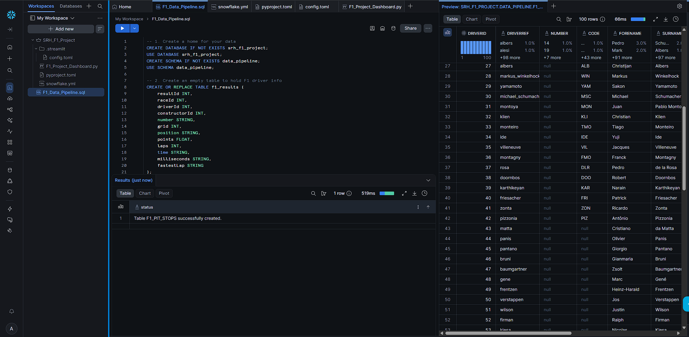
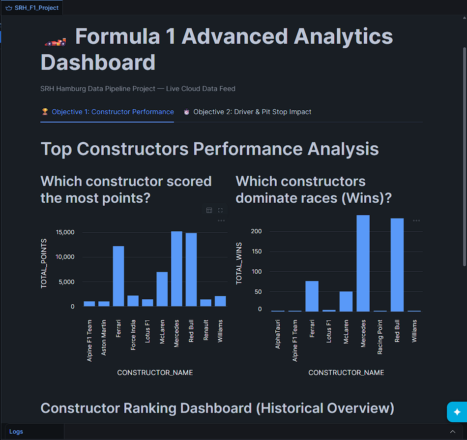
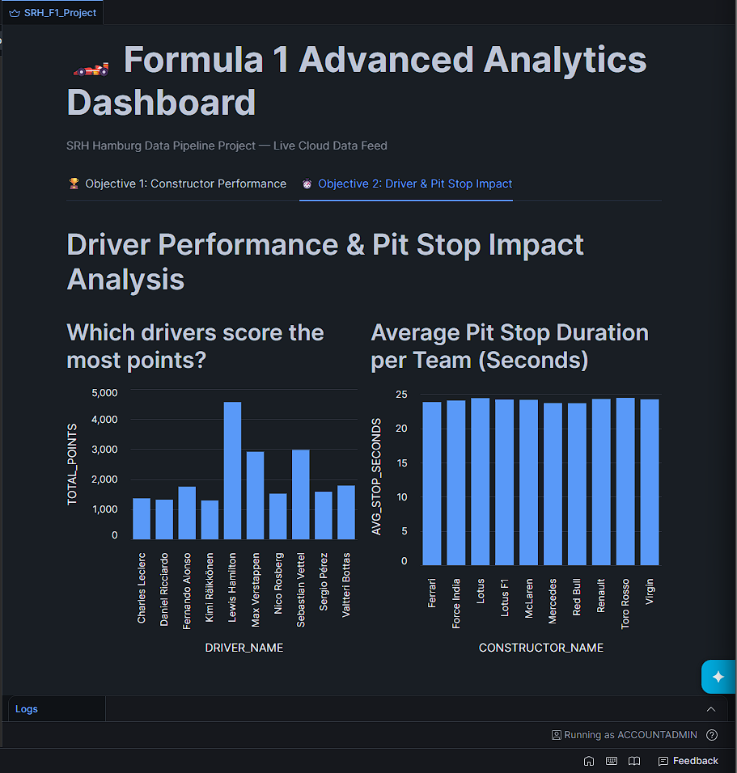
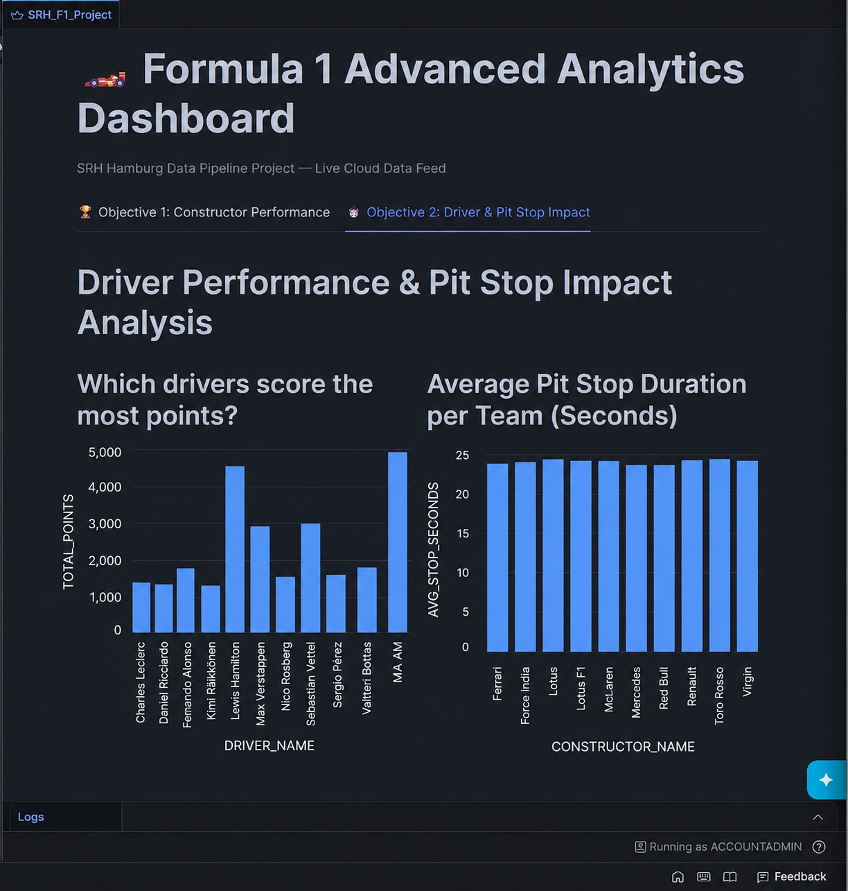

# Snowflake Pipeline Technical Details

This document contains the backend technical proof for the automated data warehouse architecture.

### Snowflake Pipeline SQL Logic
*Brief: Demonstrates the CREATE TABLE and data ingestion logic executed in Snowflake to maintain the F1 dataset.*

---

### 🚀 Proof of Automated Data Ingestion (Snowpipe)
To verify the continuous streaming architecture, test data is staged to drop directly into the AWS S3 bucket. Snowpipe is configured to detect the S3 event notification and automatically ingest the files into Snowflake, instantly updating the Streamlit dashboard without any manual SQL execution.

#### Constructor Performance Injection
**Before S3 Upload:**

**After Automated Snowpipe Ingestion:**
*[Pending live S3 data injection...]*

#### Pit Stop Impact Injection
**Before S3 Upload:**

**After Automated Snowpipe Ingestion:*

